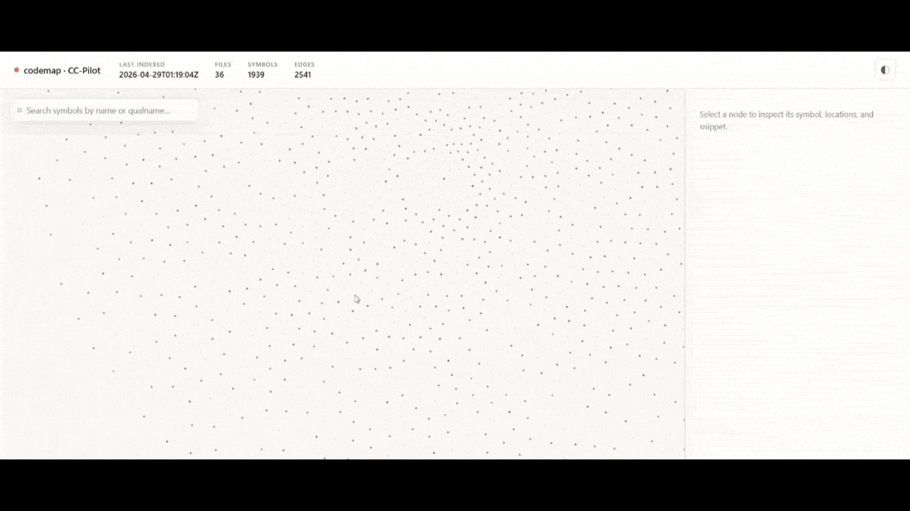

# codemap

> [한국어 문서 / Korean docs →](./README-ko.md)

Open-source CLI that indexes repositories into embedded per-repo SQLite stores
and serves precise `file:line` lookups to coding agents (Claude Code, Codex).
**No LLM** — codemap is a pure retrieval layer; the calling agent supplies all
reasoning.



```
agent  →  "where is the rate-limit logic?"
codemap →  src/api/middleware.py:142-178   func apply_rate_limit
            (4 callers, indexed 2026-04-28 18:12 KST)
agent  →  reads 36 lines instead of 1,800
```

## Why

In agentic coding, token cost is dominated by whole-file reads. The agent does
not know where the relevant code lives, so it pulls 500–2,000-line files to
find the 30 lines that matter. codemap removes that overhead by exposing a
small lookup primitive that returns identifiers + `file:line` ranges, so the
agent can partial-read instead of loading entire files.

## Highlights

- **Embedded per-repo SQLite store** at `<repo>/.codemap/index.db` plus a
  global registry at `~/.codemap/registry.toml`. No server, no daemon, no
  background process — every invocation is a fresh process with a cold-start
  budget under 50 ms.
- **Lexical retrieval (BM25)**, hand-rolled, by default. Zero ML
  dependency, fast on identifier-shaped queries (the dominant workload).
  Optional encoder rerank lives behind `-tags encoder` so the default
  binary stays small.
- **Tree-sitter parsers** for Python, Java, JavaScript, TypeScript, TSX,
  C#, and C++. Extract symbols (functions, methods, classes, variables,
  imports, constants) plus call / reference / inherit / import edges. Go and
  Rust adapters are scaffolded.
- **SKILL.md auto-install** via `codemap install-skill` so coding agents
  (Claude Code; Codex when its skill spec is final) call codemap before
  reading whole files.
- **One-shot install** via `codemap install-self` — copies the binary to
  `~/.codemap/bin` and persists it on `PATH` (HKCU on Windows, shell rc on
  Unix). No admin rights required.
- **Single static binary** for end users — release artifacts are
  cross-compiled with zig-cc, so installing codemap does not require a
  local C toolchain even though tree-sitter is CGO under the hood.
- **Local only.** Default builds make zero outbound network calls; the
  index never leaves your machine.

## Design philosophy

codemap is opinionated about what it is and what it is not. The same
trade-offs that make it a good fit for one workflow make it a poor fit
for another, so the boundaries are stated up front.

- **Agent-first, not human-first.** The primary user is a coding agent
  calling codemap as a subprocess on every relevant turn, not a human
  navigating a graph in an IDE. CLI + stable JSON contracts come first;
  GUIs come last. The interactive `graph.html` is a useful side effect of
  having the data, not the product.
- **Pure retrieval, no LLM.** codemap returns identifiers and `file:line`
  ranges. It does not embed an LLM, call an external embedding API, do
  RAG-style chunking, or interpret natural language. All reasoning is the
  caller's responsibility. This keeps cost predictable, output auditable,
  and the binary trivial to ship.
- **Cheap reuse over deep accuracy.** Indexing is incremental
  (per-file SHA-1), no-op runs finish in around 10 ms, and `status` reads
  only the SQLite meta header. An agent can call codemap on every turn
  without thinking about cost. The trade-off is that codemap deliberately
  stops at tree-sitter — it does not run a type-aware resolver, build a
  full call graph, or guarantee every edge resolves to a known symbol.
  When you need that, reach for an IDE or a language server; codemap is
  not trying to replace them.
- **Boring, dependency-light tech.** SQLite (`modernc.org/sqlite`, pure
  Go), BM25 hand-rolled instead of pulling in a search engine, ML
  dependencies gated behind a build tag, no plugin loader. Adding a
  language is a code change and a rebuild.
- **Local, single-user, no telemetry.** No server, no shared cache, no
  data leaving the machine in any default code path.

### When codemap helps, when partial-Read is enough

The bullets above describe what codemap optimizes for. They are not a
claim that codemap beats whole-file reads on every workload. A measured
look at where each one wins:

- **Single, narrow question on a small repo** (e.g. "where is the WS
  handshake magic?"). A `Grep` + one whole-file `Read` answers it in
  roughly the same token budget as `search` + `show --full`. codemap
  doesn't shrink the answer; it just changes which calls produce it.
- **Cross-module structural questions** ("who imports `MGR`?", "what
  does `routes.handle` actually call?"). codemap's `refs` and `calls`
  return **resolved=true** edges that name both endpoints — `Grep` can
  approximate this with text matching, but the false-positive rate
  rises with repo size and indirection.
- **Repeated calls across a long session.** Indexing is amortized once;
  every subsequent lookup is a fresh process under the 50 ms cold-start
  budget. The longer the session and the more often you ask, the
  cheaper codemap looks relative to re-reading files.
- **Body-deep questions** (the exact `if` condition, the full body of
  a 500-line function). The default 10-line snippet is too small;
  `show --lines N` / `--full` widen the window, and every `show`
  prints a `hint:     full body via Read <file> offset=… limit=…`
  line so the caller can fall through to a partial read in one
  round-trip. The point is to make the partial-read cheap and
  precise, not to put the whole body on every response.

The short version: codemap's edge is **edge-resolution accuracy** and
**amortized cost across many calls**, not single-call token savings on
small repos. Use it for "where does X live?" / "who calls Y?" /
"navigate this codebase across many turns"; reach for `Grep` + `Read`
when one whole-file read closes the question.

## Status

Python + six additional language parsers (Java, JavaScript, TypeScript,
TSX, C#, C++), `visualize` with `lastIndexed` surfaced everywhere,
SKILL.md installer, `install-self` for one-shot PATH setup, encoder
rerank gated behind the `encoder` build tag (ONNX wiring is a one-file
swap), and a zig-cc + GoReleaser release pipeline. Linux amd64 / arm64
and Windows amd64 binaries are published on every `v*` tag; macOS
builds are temporarily disabled (see `.goreleaser.yml`).

## Build

Requires **Go 1.25+** and a **C toolchain** (CGO is enabled by tree-sitter).

```sh
go build ./cmd/codemap
```

For optional encoder rerank support (placeholder in v0.1.x; the
ONNX session wiring is a one-file swap in `internal/encoder/onnx_enabled.go`):

```sh
go build -tags encoder ./cmd/codemap
```

A `Makefile` is provided:

```sh
make build   # builds ./bin/codemap
make vet     # go vet ./...
make ci      # vet + build + encoder-tag build
```

## Install

Download the appropriate archive from the
[Releases page](https://github.com/devchan97/code-map/releases),
extract it, and run the binary once with `install-self`:

```sh
# Linux / macOS
./codemap install-self

# Windows (PowerShell, from the extracted folder)
.\codemap.exe install-self
```

This copies the binary to `~/.codemap/bin` and registers that path on
your user `PATH` (HKCU\Environment on Windows, a marker block in
`~/.bashrc` / `~/.zshrc` / `~/.config/fish/config.fish` / `~/.profile`
on Unix). Open a new shell afterwards and `codemap` works as a bare
command. `codemap uninstall-self` reverses both side effects.

If you already have a Go toolchain and the relevant C compiler,
`go install github.com/devchan97/code-map/cmd/codemap@latest` is also
an option — it lands the binary in `$GOPATH/bin`, which most people
already have on `PATH`.

## Quick start

```sh
# 1. Initialise the index for a repo (idempotent — re-running is cheap).
codemap init /path/to/myrepo

# 2. Refresh the index incrementally (only changed files re-parsed).
codemap index .

# 3. List all known indexes on this machine.
codemap list

# 4. Search.
codemap search "applyRateLimit" --json

# 5. Look up a single symbol by qualname or by file:line.
codemap show api.middleware.apply_rate_limit
codemap show src/api/middleware.py:150

# 6. Graph queries.
codemap refs  api.middleware.apply_rate_limit   # incoming references / callers
codemap calls api.middleware.apply_rate_limit   # outgoing calls / references

# 7. Render an interactive graph.
codemap visualize . --open

# 8. Install the SKILL.md so coding agents pick up the workflow.
codemap install-skill --agent claude-code --scope user
```

All commands accept `--json` for agent consumption. The JSON schema is part of
the public contract — see `architecture.md` §6.2.

## CLI reference

| Command | Purpose |
| --- | --- |
| `codemap init [PATH]` | Idempotent setup. Creates `.codemap/`, registers in the global registry, runs the first incremental index. |
| `codemap index [PATH]` | Incremental index. Reuses the existing DB; only files whose SHA-1 changed are re-parsed. |
| `codemap reindex [PATH]` | Drop & rebuild `symbols` / `edges` / `tokens`. Use after a schema bump. |
| `codemap list [--json]` | Show every registered repo (NAME, PATH, LAST_INDEXED, FILES, SYMBOLS). |
| `codemap status [PATH\|NAME]` | Stats + `lastIndexed`. |
| `codemap forget [PATH\|NAME]` | Remove a registry entry (does not delete `.codemap/`). |
| `codemap search <QUERY> [flags]` | Primary lookup. Flags: `--repo`, `--top`, `--kind`, `--scope`, `--file`, `--rerank`, `--json`. |
| `codemap show <QUALNAME\|FILE:LINE>` | Definition + snippet. |
| `codemap refs <QUALNAME>` | Incoming references / callers. |
| `codemap calls <QUALNAME>` | Outgoing calls / references. |
| `codemap visualize [PATH\|NAME] [flags]` | Render `graph.html`. Flags: `--out`, `--open`. |
| `codemap install-skill` | Install SKILL.md. Flags: `--agent`, `--scope`, `--print`. |
| `codemap uninstall-skill` | Remove the installed SKILL.md. |
| `codemap install-self` | Copy the running binary to `~/.codemap/bin` and add it to user PATH. |
| `codemap uninstall-self` | Remove the installed binary and undo the PATH change. |
| `codemap version` | Print version, schema version, and active embedder. |

## Architecture

```
┌──────────────────────────┐
│ Coding Agent (Claude /   │
│ Codex) — all reasoning   │
└──────┬───────────────────┘
       │ argv + JSON
       ▼
┌──────────────────────────┐
│ codemap CLI              │
│  cmd/codemap → cli       │
│  pipeline / search /     │
│  graph / visualize ...   │
└──┬───────────────────────┘
   │
   ▼
walker → parser (tree-sitter) → lexical (BM25) → store (SQLite)
                                 └─ encoder rerank (optional, build-tag)
```

- The CLI process is short-lived; every invocation re-opens the SQLite file.
  Cold start budget: ≤ 50 ms.
- Per-repo index lives in `<repo>/.codemap/index.db` (gitignored).
- Global registry at `~/.codemap/registry.toml` answers "which DB does
  `codemap search` use?" via a 6-step resolver (see `architecture.md` §3.7).
- Parser, encoder, and indexer are decoupled: language adapters emit
  `core.Symbol` / `core.Edge` only; persistence is the store layer's
  responsibility.

For the full design rationale and decision summary see
[`codemap-design.md`](./codemap-design.md). For module-level architecture see
[`architecture.md`](./architecture.md).

## SKILL.md integration

`codemap install-skill` writes a SKILL.md that instructs Claude Code (or Codex
once the spec is final) to call codemap before reading whole files. The skill
body lives in [`skill/SKILL.md.tmpl`](./skill/SKILL.md.tmpl) and is rendered
with the binary name and version at install time.

Default install paths:

- Claude Code, user scope: `~/.claude/skills/codemap/SKILL.md`
- Claude Code, project scope: `<repo>/.claude/skills/codemap/SKILL.md`
- Codex: spec pending (verify at release time)

## Repository layout

```
cmd/codemap/                 # CLI entrypoint (package main)
internal/
  cli/                       # cobra subcommand handlers
  core/                      # domain types + sentinel errors
  walker/                    # filesystem enumeration + ignore rules + secrets
  parser/                    # tree-sitter adapter registry
    python/                  # Python adapter (CGO)
    java/                    # Java adapter (CGO)
    ts/                      # JavaScript / TypeScript / TSX adapters (CGO)
    csharp/                  # C# adapter (CGO)
    cpp/                     # C++ adapter (CGO)
    fallback/                # whole-file fallback for unknown languages
    {golang,rust}/           # scaffolded placeholders
  lexical/                   # tokenization + BM25 + TokenStore interface
  encoder/                   # optional dense rerank (build tag: encoder)
  store/                     # SQLite gateway (modernc.org/sqlite, pure Go)
  registry/                  # ~/.codemap/registry.toml + 6-step resolver
  pipeline/                  # init / index / reindex orchestration
  search/                    # search.Run + Show
  graph/                     # refs + calls
  visualize/                 # graph.html renderer
  skill/                     # SKILL.md installer
  install/                   # codemap install-self / uninstall-self
  platform/                  # OS abstraction (paths, atomic write, browser)
skill/SKILL.md.tmpl          # canonical SKILL.md template
scripts/                     # zig-cc wrapper scripts (one per release target)
.github/workflows/           # ci.yml, release.yml
.goreleaser.yml              # cross-platform release config (zig-cc + CGO)
```

## Privacy

- **Local only by default.** The CLI makes no outbound network calls. The
  index, registry, and any rendered HTML stay on your machine.
- **Secrets-aware walker.** Files matching common secret patterns
  (`.env`, `*.pem`, `*.key`, `id_rsa*`, `id_ed25519*`, ...) are skipped before
  reading. Content scanning rejects files containing AWS access-key prefixes
  or PEM headers. To exclude additional paths or to override the defaults
  for a project, drop a `.codemapignore` file at the repo root (gitignore
  syntax). It is honored alongside `.gitignore` on every walk.
- **No telemetry.** codemap does not phone home.

## Development

```sh
go test ./...        # all tests (CGO-free packages); python adapter tests run on CGO-enabled CI
go vet  ./...
go build ./...
go build -tags encoder ./...
```

CI (`.github/workflows/ci.yml`) runs on Linux / macOS / Windows. Tree-sitter
requires CGO; the Python parser tests are gated behind `//go:build cgo`. CI
runners have C toolchains pre-installed; on a CGO-less developer environment
the rest of the codebase still builds and tests cleanly.

Releases are produced by `.github/workflows/release.yml`, which runs
GoReleaser on a single `ubuntu-latest` runner and uses zig-cc as a universal
cross-compiler for every CGO target. One-line wrapper scripts in `scripts/`
bake each target's `-target <triple>` flag into `$CC` / `$CXX` so CGO sees
a single executable path — without that wrapper indirection, spaces in
`CC=zig cc -target …` break Go's link step. Triggered by every `v*` tag
push. Linux amd64 / arm64 and Windows amd64 are currently shipped; darwin
and Windows arm64 are deferred.

## License

[MIT](./LICENSE)
